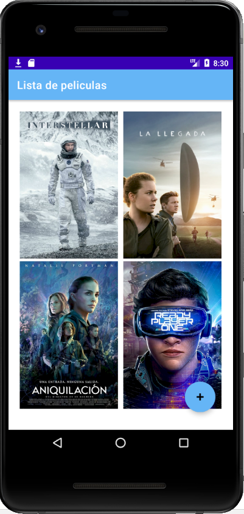
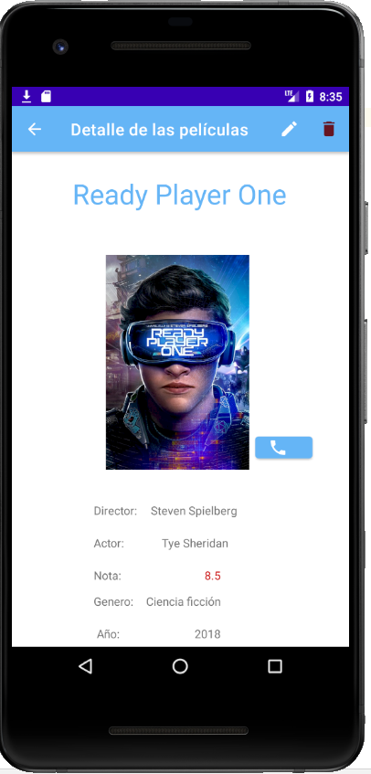

# RegueiroRodriguezIgnacioProyectoPMDM

**Proyecto realizado en el módulo de programación multimedia y dispositivos móviles sobre la gestión de peliculas al estilo IMBD o Filmaffinity**

## Construido con 🛠️

 **Estas son algunas de las librerias/clientes que he usado para desarrollar la aplicación:**
 
* [Piccaso](https://square.github.io/picasso/) - Libreria que permite cargar imagenes de forma más sencilla
* [Retrofit](https://square.github.io/retrofit/) - Un cliente HTTP de tipo seguro para Android
* [OkHttp](https://square.github.io/okhttp/) - Usada como cliente HTTP integrada en Retrofit

## Funcionalidades implementadas

**Estas son las funcionalidades realizadas:**

- Registro de usuario
- Identificación de un usuario
- Ver listado de peliculas
- Detalle de peliculas
- Creación de nuevas peliculas
- Actualización de una pelicula
- Eliminar peliculas

